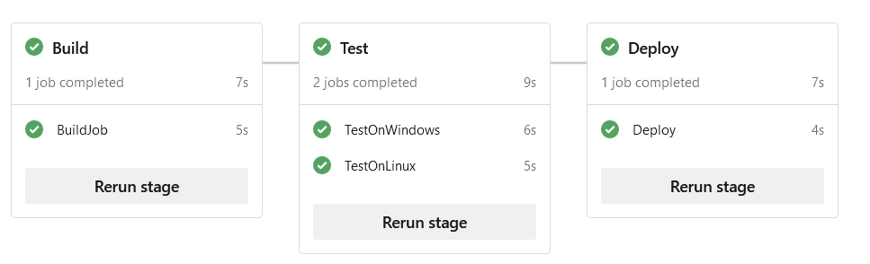

# Status  
[](https://dev.azure.com/ThomasDetemmerman/PrivateCloud/_build/latest?definitionId=23&branchName=master)

## Pipeline 2


- each stage is executed sequencially
- each job is parallel by default, unless you define a `dependsOn` *
- note that the powershell command is executed on an Ubuntu OS using powershell core.

`* _The course says that jobs are executed sequencially unless you define dependsOn: none. From my test, that statements seems incorrect._

## AZ commandos

list images and SKU's
```
az vm image list-offers --location westeurope --publisher MicrosoftWindowsServer
az vm image list-skus --location westeurope --publisher MicrosoftWindowsServer --offer windowsserver0
az vm image list-offers --location westus --publisher RedHat
az vm image list-skus --location westus --publisher RedHat --offer RHEL
```
